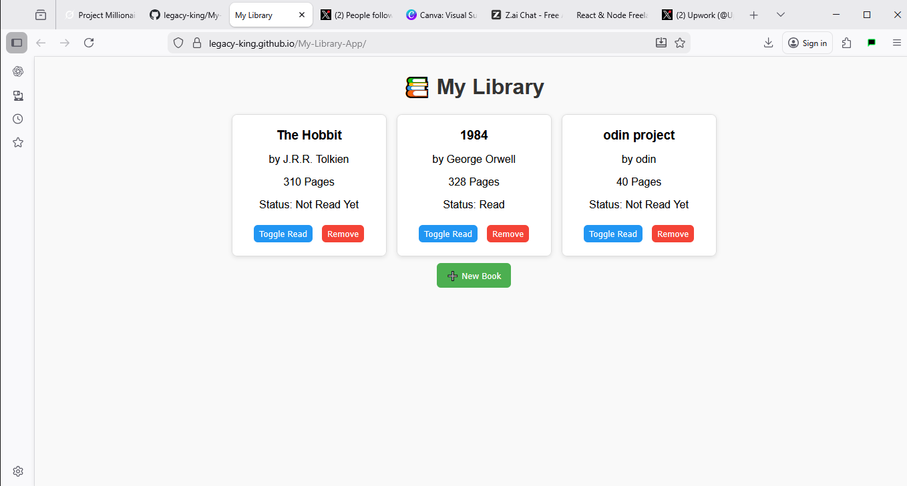
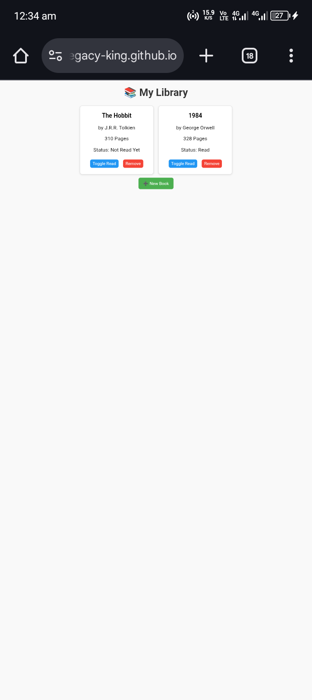

# 📚 My Library App

A simple web application built with vanilla HTML, CSS, and JavaScript to manage a personal book library.

## Features

- Add new books to the library with a title, author, page count, and read status.
- Display all books in a clean, card-based layout.
- Mark a book as 'Read' or 'Not Read Yet' with a toggle button.
- Remove books from the library.
- All data is stored in a JavaScript array and the display is dynamically updated.
-  and .

## Lessons Learned

This project was a great exercise in:
- Separating data (the `myLibrary` array) from the display (the DOM).
- Using JavaScript `classes` as blueprints for objects.
- Implementing Event Delegation to handle clicks on dynamically created elements.
- Using `data-*` attributes to link DOM elements to their corresponding JavaScript objects.
- The core Git workflow: `add`, `commit`, `push`.

#Live Demo
[Try it live here] (https://inquisitive-tiramisu-c07ac8.netlify.app)

1. Clone this repository to your local machine.
2. Open the `index.html` file in your web browser.
